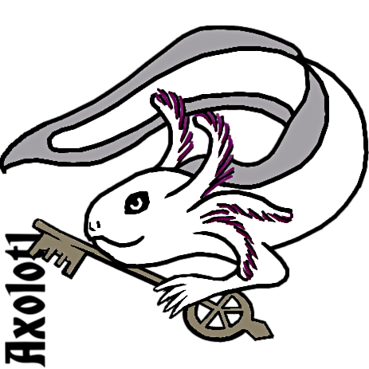

# AXOLOTL-24 Shared Task

AXOLOTL-24 stands for "_Ascertain and eXplain Overhauls of the Lexicon Over Time_"

**It is a shared task in explainable semantic change modeling, collocated with the 
[5th International Workshop on Computational Approaches to Historical Language Change 2024 (LChange'24)](https://www.changeiskey.org/event/2024-acl-lchange/).**

This Github repository will serve as the main information hub for the shared task. Example of the datasets, processing and evaluation scripts, etc will appear here in due time according to the timeline below. 

---

## Organizers
- [Mariia Fedorova](https://www.mn.uio.no/ifi/english/people/aca/mariiaf/) (University of Oslo)
- [Andrey Kutuzov](https://www.mn.uio.no/ifi/english/people/aca/andreku/) (University of Oslo)
- [Timothee Mickus](https://timotheemickus.github.io/) (University of Helsinki)
- [Niko Partanen](https://researchportal.helsinki.fi/en/persons/niko-partanen) (University of Helsinki)
- [Janine Siewert](https://researchportal.helsinki.fi/en/persons/janine-siewert) (University of Helsinki)

## Timeline (all dates preliminary)
- February 1 2024 - training data published
- March 25 2024 - test data published
- April 9 2024 - deadline for submission of the systems’ predictions
- April 10 2024 - AXOLOTL'24 test results published
- May 10 - paper submission deadline (same procedure as with other LChange'24 papers)

## Introduction
In this shared task, we challenge the participants to implement a semantic change modeling system which, given two historical corpora and a sense inventory corresponding to one of the periods, is able to:
1. Find the target word usages associated with **new, gained senses** 
2. **Describe these senses** in a way that facilitates understanding and lexicographical research.

Thus, the task is to  identify which exact senses were gained between two time periods and generate reasonable descriptions (definitions) of these senses.

To be able to use high-quality gold data, we use a simplified setup where instead of asking the participants to retrieve and analyze all target word usages in raw corpora, we provide two manually checked sets of usage examples (still of considerable size). Below, we still call them "corpora", for clarity

The shared task will feature data from **Finnish** and **Russian** languages. There will also  be a **surprise language** of lesser size at the test stage. For all these languages, we will use gold, manually annotated data to evaluate the predictions of the participant systems.

The shared task will consist of two subtasks. The participants are welcome to choose one of them or both, at their will.

## Subtask 1. Bridging diachronic word uses and a synchronic dictionary

The participants are offered two corpora, belonging to different time periods. In addition to this, they are provided with a set of **dictionary entries (sense inventories)** for the target words describing their senses in the **first** time period (accompanied by definitions). The task is to find all usages of the target words belonging to **newly gained senses**, i.e., senses not covered by the provided sense inventory. 

The assumption is that sense definitions from the dictionary, even though not always covering all word senses even from the same time period, may still be a useful additional source of information. The goal is to map word usages to the dictionary senses. This is very similar to **Word Sense Disambiguation**, with the difference being that the usages corresponding to word senses absent from the dictionary should be grouped into novel sense clusters (this is more similar to **Word Sense Induction**). In a way, this subtask is a mixture of WSD and WSI.

* **Inputs**: a set of target words, two sets of usages for each target word (a usage is a  text fragment containing a target word); target word dictionary entries with sense ids for the **first** of two time periods.
* **Predictions**: sense id for every word usage of the **second** time period (either re-using an id from the provided dictionary or adding a novel one). 
* **Metrics**: Adjusted Rand Index (ARI) for all usages and macro-F1 for usages with existing senses
* **Ground truth**: manually annotated sense inventories

## Subtask 2. Definition generation for novel word senses.

This subtask challenges the participants to submit good **descriptions/definitions for the novel senses** they found in subtask 1. The definitions can be generated from scratch or retrieved from existing ontologies: this is completely up to the participants. The organizers will map the predicted definitions to the gold standard ones and evaluate their quality with the standard NLG metrics.

* **Inputs**: Same as subtask 1
* **Predictions**: Same as subtask 1 plus a **dictionary-like definition for every novel sense of the target word** (a sense not present in the dictionary entry from the first time period)
* Metrics: BLEU/ROUGE and BERTScore. The final score is the average across all sense definitions the system generated (for one target word).
* **Ground truth**: definitions from our gold standard sense inventories

---

_[5th International Workshop on Computational Approaches to Historical Language Change 2024 (LChange'24)](https://www.changeiskey.org/event/2024-acl-lchange/), August 15, 2024, Bangkok, Thailand_
